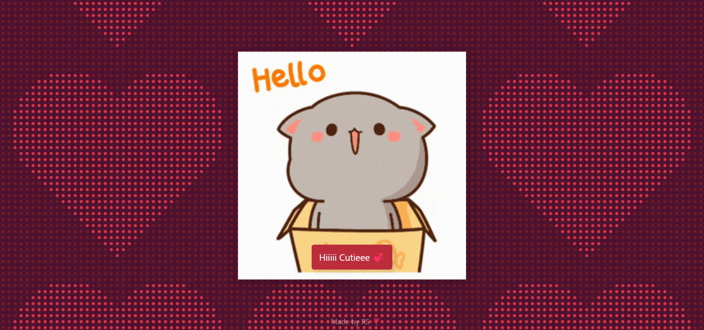
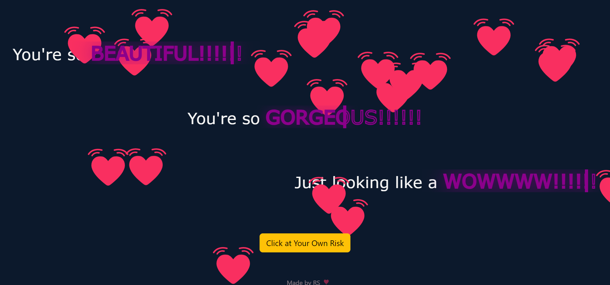
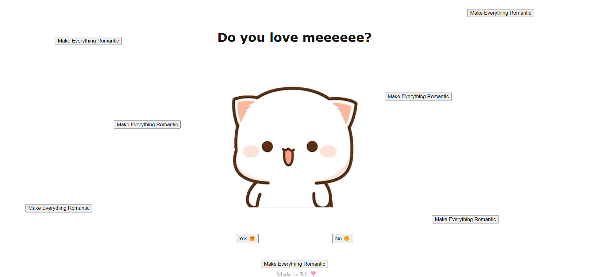
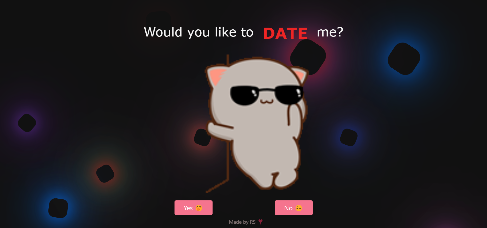
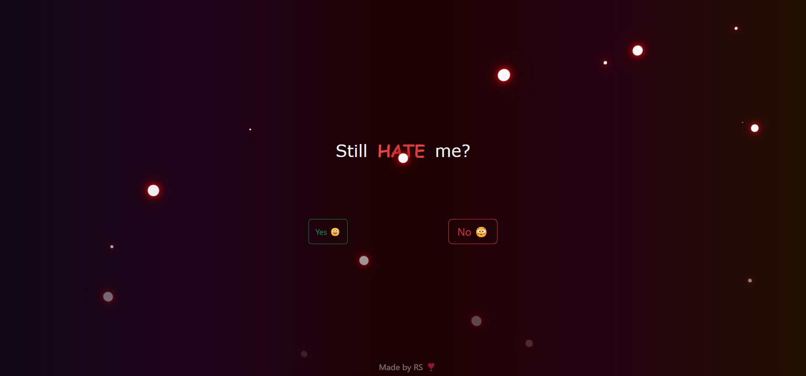
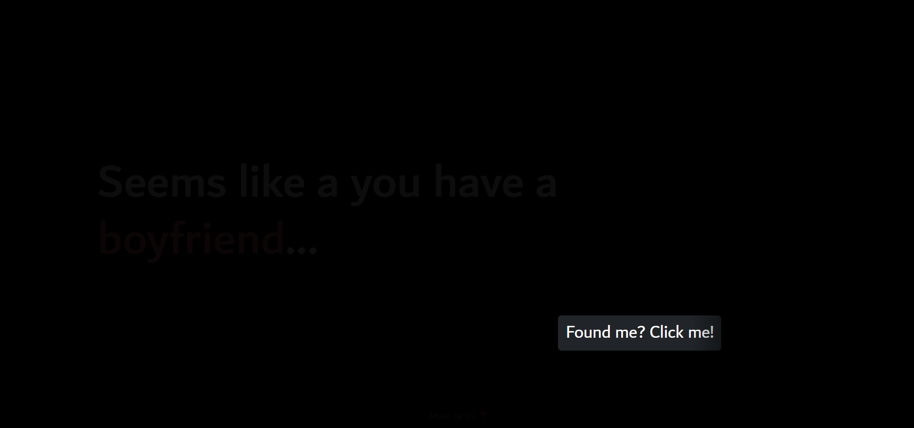
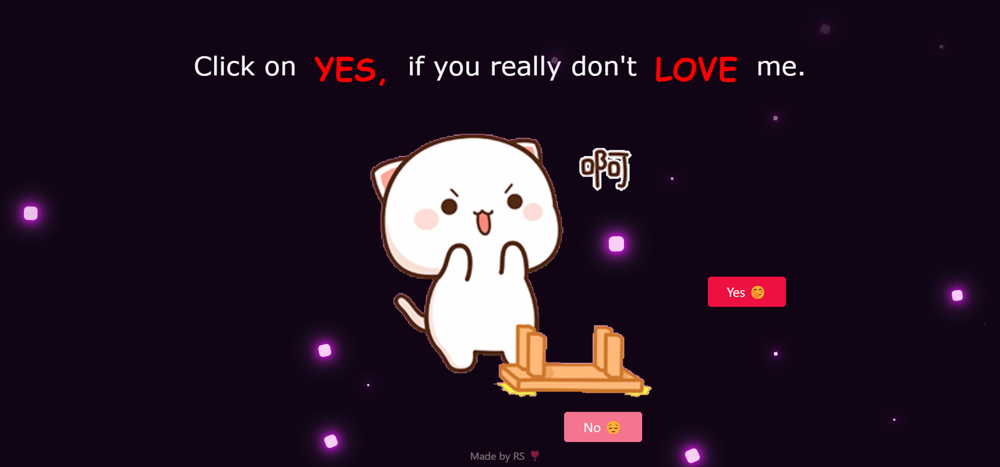
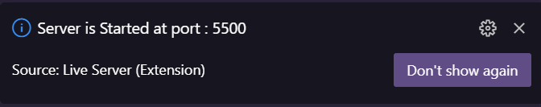

<p align="right">
    
</p>

<h1 align="center">
    But... <br>I Love You ❣️
</h1>


<h3 align ="center">"Are you facing a relentless rejection from the one you adore?" 🥺 <br>Just send this to her! 💓</h3>

https://github.com/RS-labhub/ask-her-out/assets/117426013/ed08488c-2096-4f21-b77b-d72781d80537

## But... I Love You
"But... I Love You 💓" is a fun interactive web application designed to help you propose to your crush in a creative and personalized way. Inspired by the fear of rejection and the difficulty of expressing our feelings, the project turns a simple proposal into an engaging experience that gives you a unique chance to express your love and, hopefully, win their heart. 🤗

https://github.com/RS-labhub/ask-her-out/assets/117426013/6f1f4923-50d1-4b85-96bd-99a1b84c78ee

<p align="center">Video Demonstration</p>

## Screenshots
<p align="center">
  
  
  
  
  
  
  
</p>

https://github.com/RS-labhub/ask-her-out/assets/117426013/59831c53-631f-4c14-b8fc-10a4a534eb0a


## Tech & Dependencies

1. <a href="https://app.flagsmith.com/">Flagsmith</a></h2>
2. Bootstrap 5
3. HTML5, CSS3, JavaScript

## Setup and Contributions Guidelines

- These are the steps required to install/run the project.
- You can also directly proceed by using the live server [demo link](https://rs-labhub.github.io/ask-her-out/)


1. Clone the Repository: Open a terminal or command prompt and clone the ask-her-out repository from GitHub using the following command:

  ```bash
    git clone https://github.com/RS-labhub/ask-her-out.git
  ```

2. Navigate to the Repository Directory: Change your current directory to the cloned ask-her-out repository:

  ```bash
    cd ask-her-out
  ```

3. Run ask-her-out web application using "Open with Live Server"

5. Once the application is running, open a web browser and navigate to the specified address, and yeah! you're all set to use the ask-her-out.
<p align="center">
  The running port should look like this
</p>
<p align="center">

</p>

### Meet the Author


<div align="center">

<a href="mailto:rohansrma3@gmail.com">Email</a> · <a href="https://www.linkedin.com/in/rohan-sharma-9386rs/">LinkedIn</a> · <a href="https://x.com/rrs00179">X/Twitter</a>

</div>


<p align="right">Note: The site is not responsive yet</p>

<p align="right" >
    
</p>
