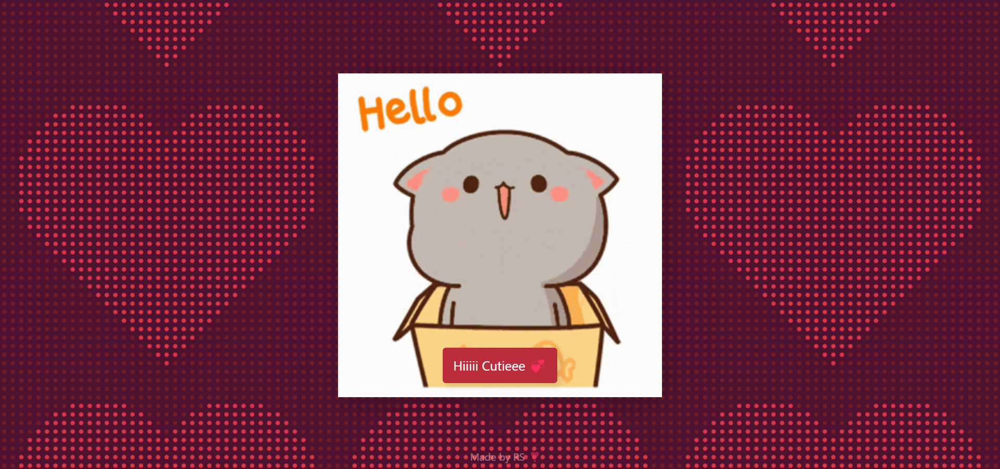
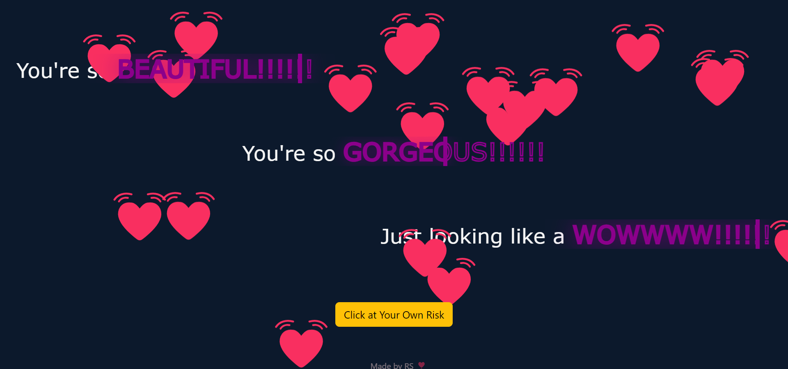
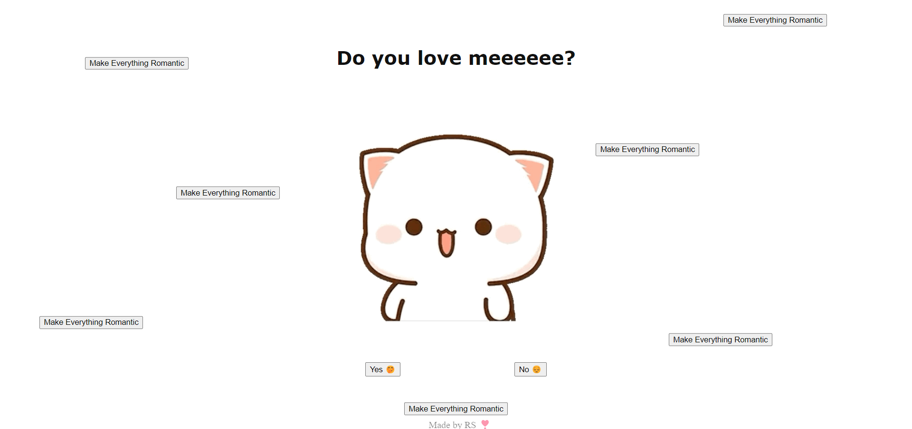
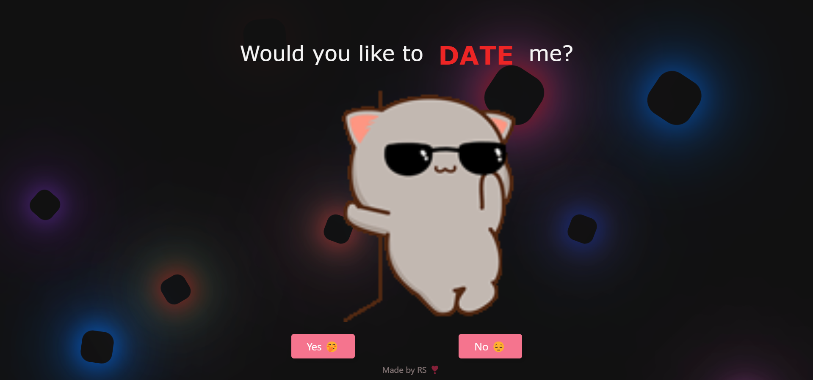
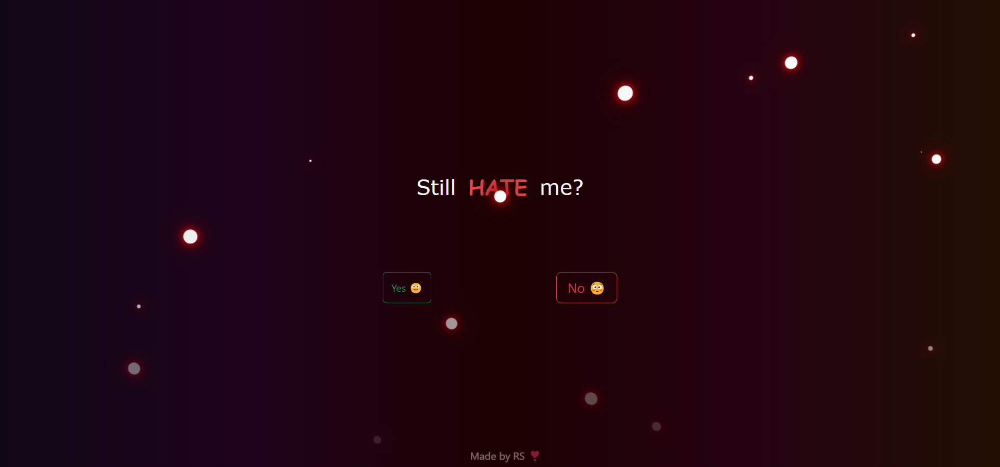
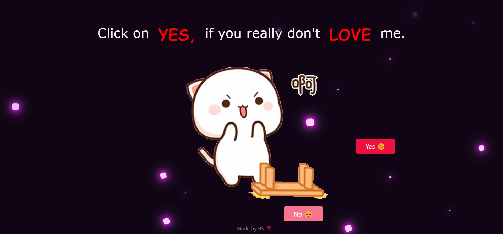
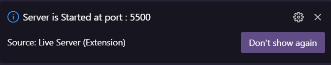

<p align="right">
    
</p>

<hr>
<h1 align="center">
    BUT... <br>I LOVE YOU aishiki ❣️
</h1>
<hr>

<
- [Contact](#email-contact)
<br>

##  :movie_camera: Demo
- After a brief introduction, let's dive a little more inside the project.
- Here is the walk-through of "But.. I Love You" project.

https://github.com/RS-labhub/I-Love-You/assets/117426013/6f1f4923-50d1-4b85-96bd-99a1b84c78ee

<p align="center">Video Demonstration</p>
<br>

## Screenshots
<br>
<p align="center">
  
  
  
  
  
  
  
</p>

https://github.com/RS-labhub/I-Love-You/assets/117426013/59831c53-631f-4c14-b8fc-10a4a534eb0a


# Dependencies

<h2>1. <a href="https://app.flagsmith.com/">Flagsmith</a></h2>

https://github.com/RS-labhub/I-Love-You/assets/117426013/c22a0339-0195-471f-9fe4-b0cfc5e31fcf

<p align="center">Working Demo </p>

<br>
<h2>2. <a href="https://getbootstrap.com/docs/5.0/getting-started/introduction/">Bootstrap 5</a></h2>
<br>
<h2>3. HTML5, CSS3, JavaScript</h2>
<br>

## Setup and Contributions Guidelines

$~$

##  :outbox_tray: Set up
- These are the steps required to install/run the project.
- You can also directly proceed by using the live server [demo link](https://rs-labhub.github.io/I-Love-You/)


1. Clone the Repository: Open a terminal or command prompt and clone the I-Love-You repository from GitHub using the following command:

  ```bash
    git clone https://github.com/RS-labhub/I-Love-You.git
  ```

2. Navigate to the Repository Directory: Change your current directory to the cloned I-Love-You repository:

  ```bash
    cd I-Love-You
  ```

3. Run I-Love-You web application using "Open with Live Server"

5. Once the application is running, open a web browser and navigate to the specified address, and yeah! you're all set to use the I-Love-You.
<p align="center">
  The running port should look like this
</p>
<p align="center">

</p>

$~$

**Set Up Your Environment**

1. `Fork` our repository to your GitHub account. 
2. `Clone` your fork to your local machine. 
    Use the command `git clone https://github.com/RS-labhub/I-Love-You/.git`.
3. Create a new branch for your work. 
    Use a descriptive name, like `fix-login-bug` or `add-user-profile-page`.
    
**Commit Your Changes**

- Commit your changes with a _clear commit message_. 
  e.g `git commit -m "Fix login bug by updating auth logic"`.

**Submit a Pull Request**

- Push your branch and changes to your fork on GitHub.
- Create a pull request, compare branches and submit.
- Provide a detailed description of what changes you've made and why. 
  Link the pull request to the issue it resolves. 🔗
    
**Review and Merge**

- I will review your pull request and provide feedback or request changes if necessary. 
- Once your pull request is approved, we will merge it into the main codebase 🥳

$~$

### :people_holding_hands: Meet the Author


### :email: Contact 
- Email and social media links.
- Head over to my github handle form [here](https://github.com/RS-labhub)

<p align="left">
<a href="https://twitter.com/rrs00179" target="blank"></a>
</p>
<p align="left">
<a href="https://www.linkedin.com/in/rohan-sharma-9386rs/" target="blank"></a>
</p>

<p align="center">
    People who <a href="https://github.com/RS-labhub/I-Love-You/stargazers">STARRED</a> this repo
</p>

<p align="right">Note: The site is not responsive yet, but it will be responsive soon.</p>

<p align="right" >
    
</p>
